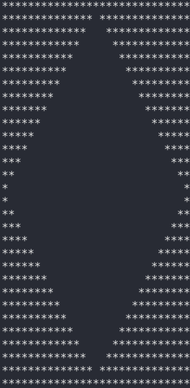

# RLEpictures

RLE format, save, open & create pictures with CLI commanded. 
Now works on linux and windows (rewritten and tested in Ubuntu 20.04.4) 
To compile with GCC: gcc Struct.h Main.c Initializer.h Initializer.c InternalLogic.h InternalLogic.c ReadWriteFunctions.h ReadWriteFunctions.c CreateDrawing.h CreateDrawing.c -lm -o MAIN 
To run: ./MAIN 
Example: 
 
Command list: 
open_rle file_path 
open_txt file_path 
save_rle file_path 
save_txt file_path 
create_square size regular/invert 
create_triangle size regular/invert 
create_romb size regular/invert 
print 
exit 
help
