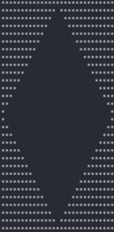

# RLE pictures

RLE format, save, open & create pictures with CLI commanded.<br>
Works on linux and windows (rewritten and tested in Ubuntu 20.04.4)

To compile with GCC:
```shell
make
```

Example of generated picture:<br>
<br><br>
Command list:<br>
```shell
open_rle file_path
open_txt file_path
save_rle file_path
save_txt file_path
create_square size regular/invert
create_triangle size regular/invert
create_romb size regular/invert
print
exit
help
```